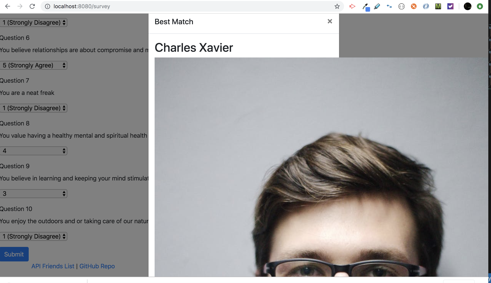

# FriendFinder
Answer our survey to find the friend you have most in common with!

## Use
Users will visit our webpage to access a survey which will ask them a series of questions. Once users click submit, our survey will query our database to result the friend with the closest answer matches to yours. Our app also saves user data when someone uses our survey. This app uses Node and express for routing. 

## Results

